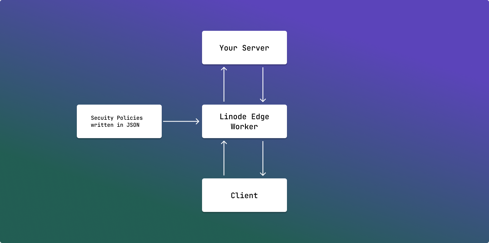

# Liguard

> A very simple customizable and configurable firewall deployable on Linode Edgeworker

## 🤔 What is Liguard?

Liguard is an `Edge cloud firewall reverse proxy` with an inbuilt ddos prevention solution. Does that sound complex? Let's break it down.

- **Cloud:** A system/server that is sitting on the cloud
- **Firewall:** A system that denies/allows a packet based on some instruction and conditional logic
- **Reverse Proxy:** A system that sits in-front of your actual server and forward the request to your actual server safely
- **DDoS Protection:** A system that detects DDoS and contains the attack

Liguard is a combination of all these! Yes, you read that right.

Imagine you wanted to **block people using iPhone** to access your server, or **people using Chrome** or accessing from IPs of specific location. You can do that all with Liguard!

What are the major advantages of using Liguard?

- **Declarative security policies using JSON**
- Runs on Edge, thanks to linode's EdgeWorker service

What are some upcoming features?
- Promethues and Grafana support for better analysis of DDOS

## 💻 Usage

You can modify the `configuarations.js` and add your own security policies in JSON!

The following is an example below:

```json
{
  "siteConfigs": [
    {
      "siteData": {
        "siteName": "google",
        "forwardingUrl": "https://google.com",
        "blockedOs": ["iPhone"],
        "blockedBrowser": ["Chrome"],
        "blockedDevice": ["iPhone"],
        "blockedOSVersion": ["15.1"],
        "blockedLocations": [""],
        "blockedIPs": ["0.0.0.0", "8.8.8.8"]
      }
    },
    {
      "siteData": {
        "siteName": "github",
        "forwardingUrl": "https://github.com",
        "blockedOs": ["Mac"],
        "blockedBrowser": ["Chrome"],
        "blockedDevice": ["iPhone"],
        "blockedOSVersion": ["15.1"],
        "blockedLocations": ["India"],
        "blockedIPs": ["0.0.0.0", "8.8.8.8"]
      }
    }
  ]
}
```

## ⬇ Installation

- Clone this repository using the command `git clone https://github.com/DarthBenro008/liguard`
- Follow [this](https://techdocs.akamai.com/edgeworkers/docs/deploy-hello-world-1) tutorial to deploy linode's edgeworker

## 🛠 Architecture and Structure



## ⭐ Show your support

Give a ⭐ if you liked this project!

Spread the word to your fellows to guard all the servers out there!

## 🤝 Contributions

- Thanks to the `Faisal Salman <f@faisalman.com>` as this project uses `UAParser.js v1.1.34`'s source code to parse User-Agent
- Feel Free to Open a PR/Issue for any feature or bug(s).
- Make sure you follow the [community guidelines](https://docs.github.com/en/github/site-policy/github-community-guidelines) and read [CONTRIBUTING.md.md](https://github.com/DarthBenro008/liguard/CONTRIBUTING.md)!
- Feel free to open an issue to ask a question/discuss anything about liguard.
- Have a feature request? Open an Issue!

## ⚖ License

Copyright 2023 Hemanth Krishna

Licensed under MIT License : https://opensource.org/licenses/MIT

<p align="center">Made with ❤ and single cup of coffee</p>
